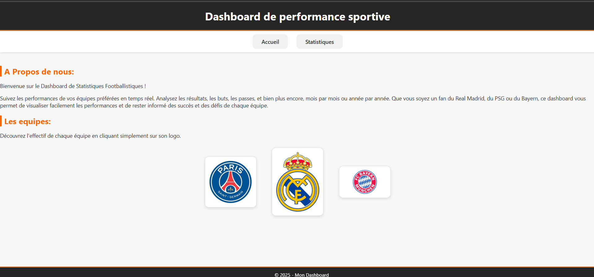
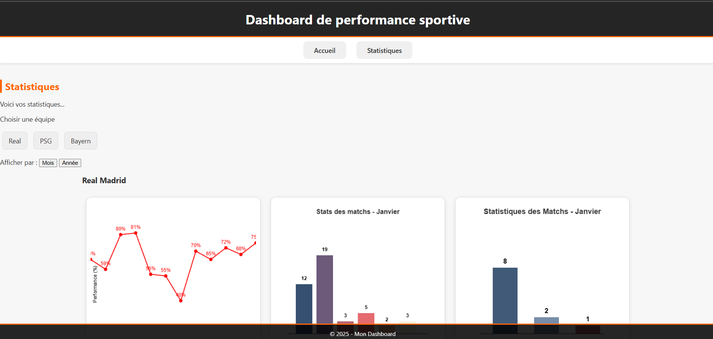
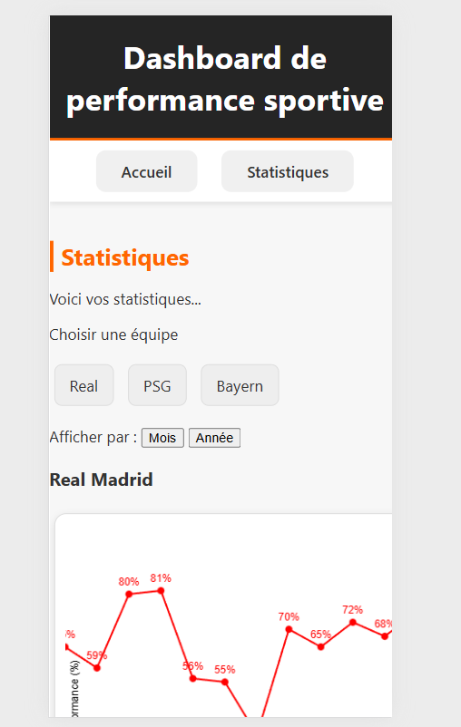

# Dashboard des équipes de football populaires:
## Description:
Ce projet est un Dashboard interactif de suivi des performances sportives, principalement axé sur le football. Il permet aux utilisateurs de visualiser les performances des équipes de football populaires comme le Real Madrid, le PSG et le Bayern Munich à travers différents indicateurs et graphiques.

Le dashboard est conçu pour offrir une expérience utilisateur intuitive et visuelle, en mettant l’accent sur :
La navigation entre différentes pages : Accueil et Statistiques.
L’affichage d’informations sur les équipes et leurs effectifs via des liens externes vers leurs sites officiels.
La visualisation graphique des statistiques : performances, résultats et statistique par équipe.
La possibilité de choisir la période d’affichage des statistiques (mois ou année).
### Fonctionnalités principales
-Page d’accueil : Présentation du projet et des équipes avec logos cliquables.

-Page Statistiques : Graphiques interactifs par équipe avec choix de la période (mois/année).

-Navigation simple : Les utilisateurs peuvent changer de page ou d’équipe facilement.
-Responsive Design : Le dashboard s’adapte aux différentes tailles d’écran.

#### Technologies utilisées
-HTML5 pour la structure de la page.
-CSS3 pour le style et la mise en page.
-JavaScript pour la logique interactive (navigation entre pages et affichage des statistiques).
-Canvas HTML5 pour les graphiques et visualisations.
##### Lien vers le projet en ligne
-Le dashboard est hébergé sur GitHub Pages et accessible via le lien :
[lien](https://lamiss2598.github.io/lamiss_hamouda_dashboard_equipes/)
###### Nouveautés explorées:
-Maîtrise de GitHub : commits, push, gestion de branches
-Graphiques interactifs par équipe
-Mise à jour dynamique du contenu sans créer de nouveaux fichiers HTML
###### Difficultés rencontrées:
-Mise en page et affichage des graphes spécifiques à l’équipe choisie
-Gestion du changement de période pour les statistiques
-Dessin des graphiques interactifs
###### Solutions apportées:
-Recherches sur W3Schools et autres sites de programmation
-Voire des exemples de dashboards